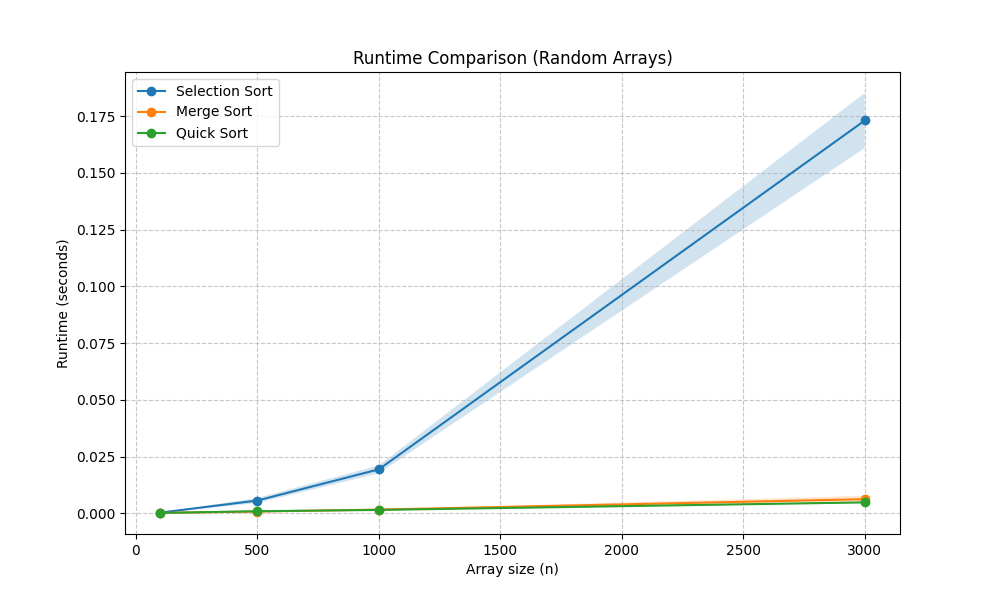
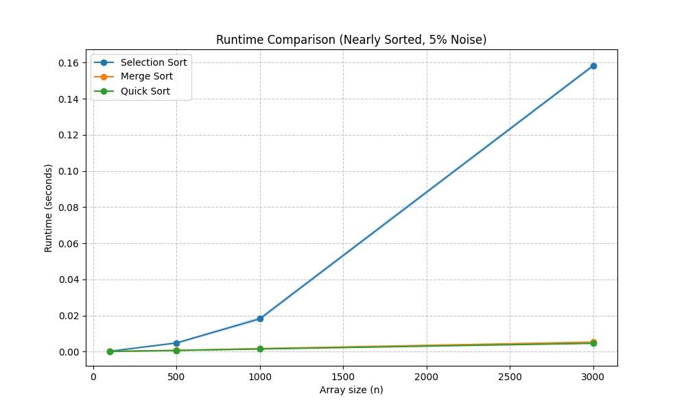

# Data Structures - Sorting Assignment

**Student Name:** Jonathan yaron

## Selected Algorithms
1. Selection Sort (ID: 2)
2. Merge Sort (ID: 4)
3. Quick Sort (ID: 5)

---

## Part B - Random Arrays

**Explanation:**
In this graph, we can clearly see the difference in theoretical time complexities. 
Selection Sort has a time complexity of O(n^2), which is why its runtime grows quadratically (forming a parabola) as the array size increases. On the other hand, Merge Sort and Quick Sort both have an average time complexity of O(n log n), which makes them significantly faster for larger arrays, appearing almost flat compared to Selection Sort at this scale.

---

## Part C - Nearly Sorted Arrays (5% Noise)

**Explanation:**
When running the algorithms on a nearly sorted array with 5% noise:
1. **Selection Sort:** The runtime did not change significantly. This is because Selection Sort always scans the entire remaining array to find the minimum element, regardless of the initial order of the elements. It remains strict O(n^2).
2. **Merge Sort:** Maintained its O(n log n) complexity as its divide-and-conquer mechanism splits and merges arrays regardless of their initial sorted state.
3. **Quick Sort:** Because our implementation uses a randomly selected pivot, we successfully avoided Quick Sort's worst-case scenario (O(n^2)) that usually happens on sorted arrays. It performed extremely well, maintaining its fast O(n log n) runtime.